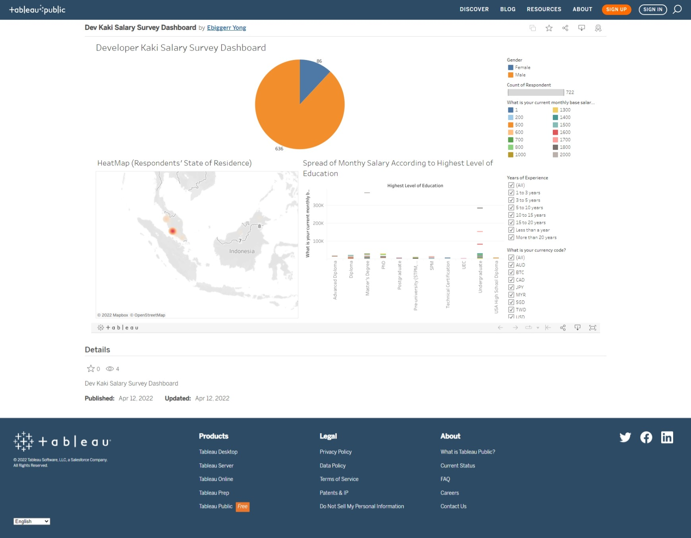

# Developer Kaki (Facebook Community) Salary Survey

The survey is collecting information such as gender, age, salary, state of residence, salary, job title, years of experience, and many more from the members in the community.

Column in the dataset

| Column Name   |     Description     |  
|----------|:-------------:|
| Table Name | The name of the table that data is coming from. |
| Timestamp |   The timestamp of submission   |
| Gender | Gender of respondent |
| Age | Age of respondent |
| Nationality | Nationality of respondent |
| Current Country of residence | Country of Residence |
| Current State of Residence | State of residence _**Correction only done to states in Malaysia**_ |
| Current City of Residence | City of residence _**Data in this column remain untouched**_ |
| Highest Level of Education | Highest level of education obtained by the respondent |
| Name of Highest Degree Obtained | The name of highest level of education obtained - E.g. Bachelor of Computer Science _**Cleaned the data, use the data from the previous column, if the data is `Computer Science`, then combine with `Bachelor's Degree` from the previous column, it means the respondent is a graduate of Bachelor of Computer Science**_ |
| Name of School or University | Name of the institution _**Correction only done to institutions in Malaysia**_ |
| Is the degree tech-related | Is it tech-related? |
| Did you go through a bootcamp to learn technical skills? | Experience in bootcamp? |
| Professional Certification (Eg. CCNA, CEH, GCP Cloud Associate) | Holder of professional certificates? |
| Name of Bootcamp Course | The name of bootcamp _**Correction only done to bootcamp/platform that is significant such as Udemy or Coursera, etc.**_ |
| Name of Professional Certification(s) | The name of professional certificates _**Focusing on  Microsoft, AWS, CISCO, GCP, Python Certifications**_ |
| Job Title | Current job title |
| What is your currency code? | Currency code of salary that currently paid from their employer |
| What is your current monthly base salary? | The base salary |
| What is your current bonus compensation per year? | **Most of the data in this column remain untouched (Too tedious to do data cleansing)** |
| What is your current equity (stock) compensation per year? | **Most of the data in this column remain untouched (Too tedious to do data cleansing)** |
| How many days of annual leave are you entitled to? | Annual leave |
| Company Benefits | _**The answers are from multiple choices question**_ |
| What technologies do you use for work on a regular basis? | **Most of the data in this column remain untouched (Too tedious to do data cleansing)** `But you might be able to see the pattern such as .NET, Android, Java, Python or JavaScript` |
| Company location | Location of the company |
| Company industry | **Do not have significant meaning, TBH** |
| What is the size of your company? | Size of the company |
| What is the size of your tech team? | Size of the team/department/division |
| What's the name of your company? (Optional) | **Do not have significant meaning, TBH** Unless you want an estimation of their pay range |
| Satisfaction level of current job | Too subjective |
| Years of experience | Years of experience |
| Number of past employments/jobs (excluding the current one) | The count of ex-employer |
| What was your starting monthly salary? | **Might be useful to show an estimation on the career growth based on tech stack or skillset** |
| Indicate in 3-character currency code for starting monthly salary | _Do not have significant meaning, IMO_  |

## Data cleansing

The data cleansing process is quite aggressive on the raw dataset and requires a lot of manual work on certain columns.

For example, `Name of Highest Degree Obtained`

Let's say that one of the respondent answered "Bachelor of Computer science (Major Networking)", I will categorize it under `Computer Science`

I don't see any meaningful impact from preserving the full details of the name. It only makes the filtering ineffective.

To give a clearer idea of what I am saying. In the raw dataset, we can have

- Bachelor of Computer science (Major Networking)
- Bachelor of Computer science (Software Development)
- Bachelor of Computer science (Multimedia)

By removing the specifications, we might be able to do a comparison on the salary among `Computer Science` graduate and `Software Engineering` graduate. (But, is the comparison meaningful? Probably not.)

### Cleaning the noise

There is no way we can verify the salary information, therefore you can expect that there will be noise data (data that does not makes sense)

For example, salary that does not makes sense (monthly salary of MYR 9.2mil and the age of respondent is 15).

> Some salary ranges from RM1 to RM1700. These data coming from intern or student. I keep them in the dataset, but you can filter them out for your own data analytics purpose.

## Cleansed Column (Not an exhaustive list)

1. **Gender** (It is not politically correct, but I removed `Others` from the dataset)
2. **Current State of Residence** (Corrected the data to valid states in Malaysia. For example, `Puchong` to `Selangor`)
3. **Name of highest degree obtained** (Categorized the data into major branch. For example, `Information Technology`, `Software Engineering` and `Computer Science` )
4. **Name of School or University** (Corrected most of the significant institutions in Malaysia only. For example, `utar` to `UTAR University Tunku Abdul Rahman`, `usm` to `USM Univesiti Sains Malaysia`)
5. **Job Title** (Categorized some of the data into more general job title. For example, `mobile developer` to `Mobile Application Developer`)

    a. Ranking of the Job Title at the time of writing this (Based on the count) - `Software Engineer` (134), `Software Developer`(48), `Senior Software Engineer`(35), `Full Stack Developer`(25), `Front End Developer`(23), `Data Engineer`(18), `Web Developer`(15), `Mobile Application Developer`(15), `Data Scientist`(15), etc.

6. Tech Stack used (Quite a number of the responses is in the form of a mixture of tech stack - Such as `ASP.NET Core` and `Angular`. Therefore, a lot of processing would need to be done if you want a answer a question like `How many among the respondent use Angular or XXX?`)

7. Years of Experience (Categorized the data into)

    - Less than a year
    - 1 to 3 years (_1.0000 year to 2.9999 years_)
    - 3 to 5 years (_3.0000 year to 4.9999 years_)
    - 5 to 10 years
    - 10 to 15 years
    - 15 to 20 years
    - More than 20 years

## Result - File format

`*.txt` - Version-control friendly. (tab-separated values)

`*.xlsx` - User friendly to view the datasheet using Microsoft Excel

## Proof of Concept

The dashboards made using Tableau software. So far, 3 different dashboard.

[Link to the public dashboard](https://public.tableau.com/app/profile/ebiggerr.yong/viz/DevKakiSalarySurveyDashboard/Dashboard1)

[Link to the public dashboard](https://public.tableau.com/app/profile/ebiggerr.yong/viz/DevKakiSalarySurveyDashboard/Dashboard2)

[Link to the public dashboard](https://public.tableau.com/app/profile/ebiggerr.yong/viz/DevKakiSalarySurveyDashboard/Dashboard3)

## Disclaimer

I am not an expert of data engineering, so the cleansing done to the data might introduced a certain degree/level of corruption to the dataset due to aggressive cleansing/incorrect practices.

## Credits to the Dataset Owner, Survey Initiators, Volunteers, etc.

- Daren Tan [Linkedin](https://www.linkedin.com/in/daren-tan/)
- Sook Yan Hue
- Team volunteers for helping to create this detailed survey
- All the respondent from Developer Kaki

Thank you for sharing and improving the dataset.
